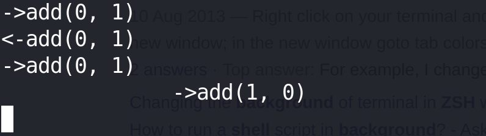

- 姓名：杨淳瑜
- 学号：22307140114

# 1

```
./vector-deadlock -n 2 -l 1 -v
->add(0, 1)
<-add(0, 1)
              ->add(0, 1)
              <-add(0, 1)
```
做两次相加，一个thread获得lock然后释放lock，另一个thread才能开始

# 2

必须loop的数量非常大才可能死锁

死锁原因：获得锁的顺序不一致

```c
Pthread_mutex_lock(&v_dst->lock);
Pthread_mutex_lock(&v_src->lock);
```



# 3

n = 1肯定不会锁，因为思索需要至少两个线程才行

# 4

```c 
if (v_dst < v_src) {
	Pthread_mutex_lock(&v_dst->lock);
	Pthread_mutex_lock(&v_src->lock);
    } else if (v_dst > v_src) {
	Pthread_mutex_lock(&v_src->lock);
	Pthread_mutex_lock(&v_dst->lock);
    } else {
	// special case: src and dst are the same
	Pthread_mutex_lock(&v_src->lock);
}
```
通过比大小的方式，保证了锁的顺序。如果两个地址一样，则只需要锁一个，不然连续锁自己两次没有意义。

# 5

用了0.06s

|   | 1e4  | 1e5  | 1e6  | 1e7   |
|---|------|------|------|-------|
| 2 | 0.01 | 0.06 | 0.53 | 5.66  |
| 4 | 0.04 | 0.38 | 3.53 | 35.40 |
| 8 | 0.06 | 0.53 | 4.85 |       |

# 6 with `-p`

|   | 1e4  | 1e5  | 1e6  | 1e7  |
|---|------|------|------|------|
| 2 | 0.00 | 0.03 | 0.31 | 3.04 |
| 4 | 0.01 | 0.05 | 0.45 | 4.47 |
| 8 | 0.01 | 0.05 | 0.47 | 4.62 |

# 7

The first call to pthread mutex trylock() 是必要的，相当与让步，类似与perterson algorithm

|   | 1e4          | 1e5          | 1e6            |
|---|--------------|--------------|----------------|
| 2 | 0.03/51617   | 0.31/651967  | 3.19/6861412   |
| 4 | 0.14/188638  | 1.50/2109817 | 11.10/15978437 |
| 8 | 1.34/1222501 | 7.57/7891215 | 76.78/80908585 |

比global-order慢多了

# 8

想法是好的，所外面加锁，不会出现因为加锁顺序不同导致的死锁

锁外面加锁同一时间只有一个线程可以做运算，这对于-p的情况影响很大

# 9

使用原子指令 `fetch_and_add` 实际上是对vector中每一个元素加锁，而整个vector的加法操作是不能保证正确的。

# 10

Without `-p` 和 with `-p` 都要慢将近10倍，原因可能是不断在用户态和内核态转换